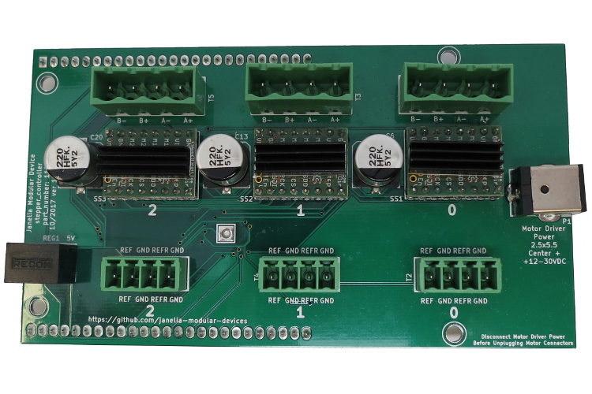
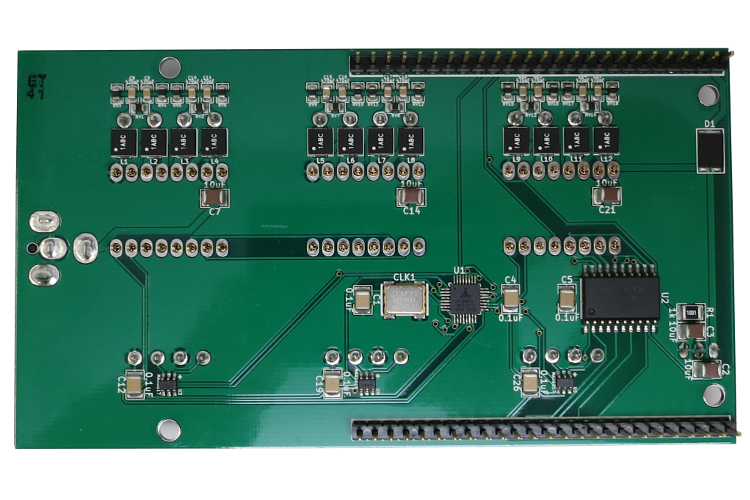
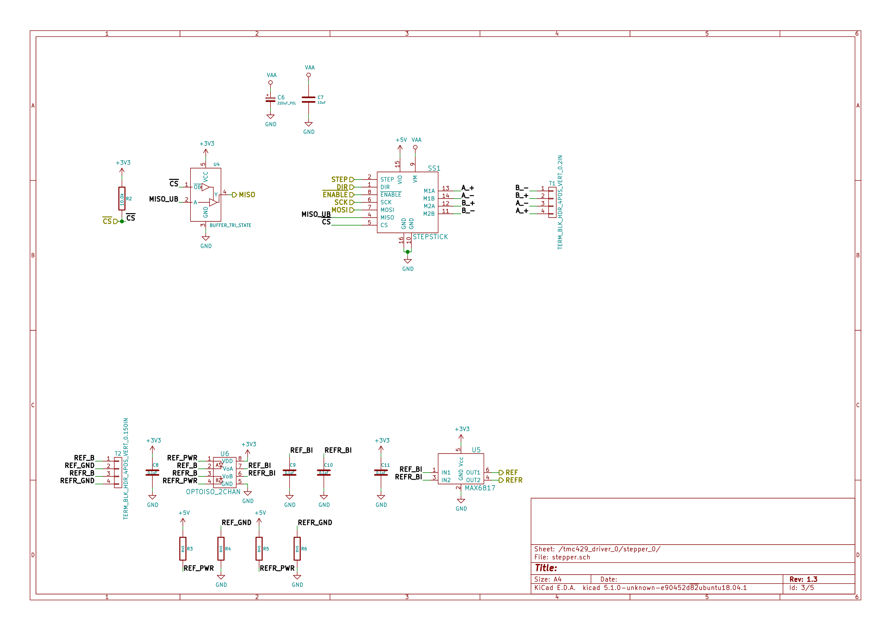
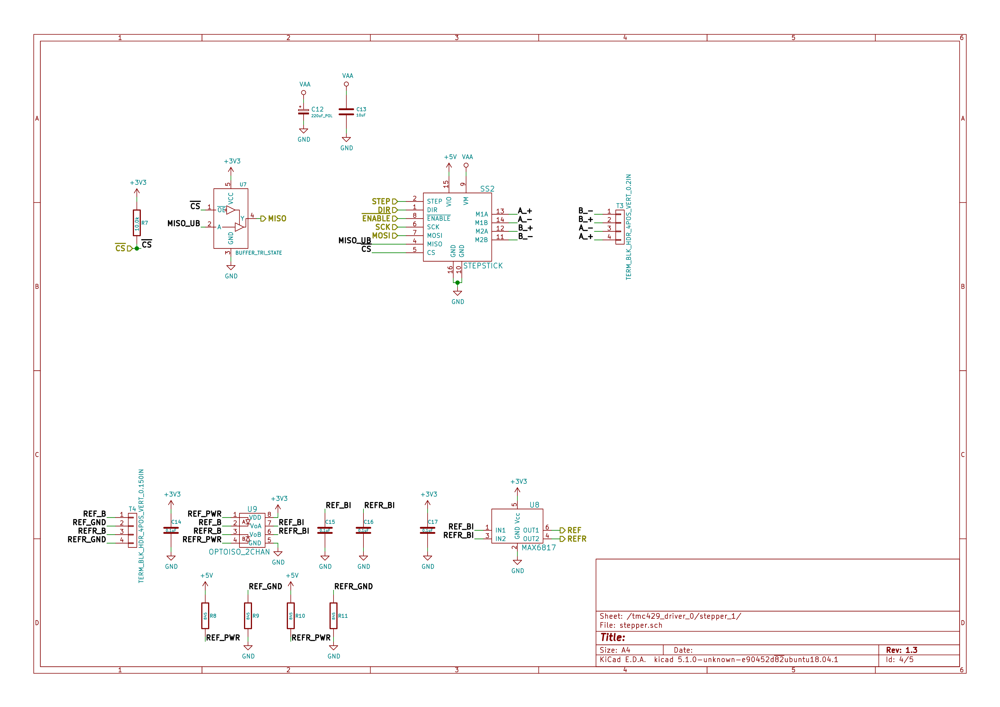
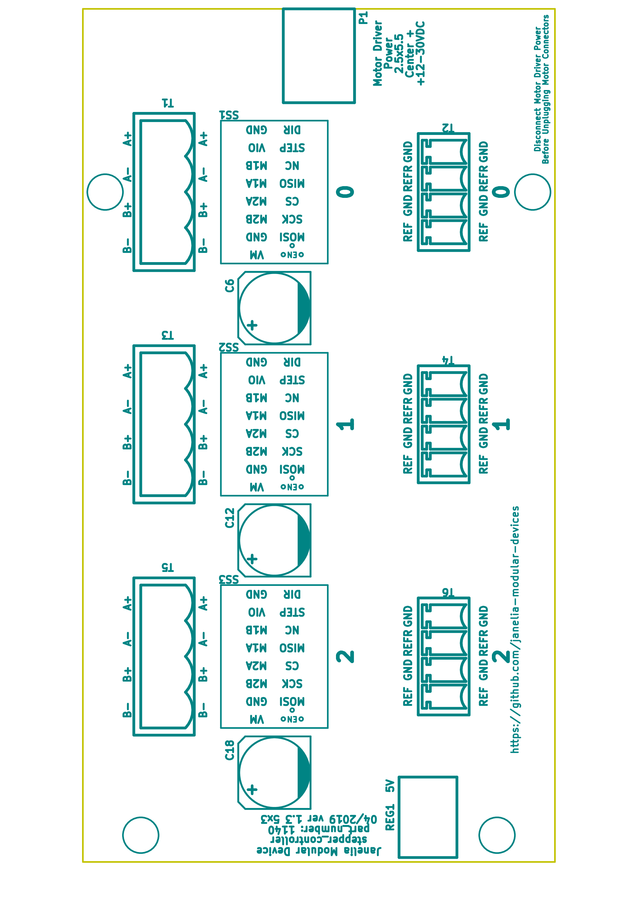

- [Repository Information](#orgf5e7a6c)
  - [Description](#org6e60af1)
- [Images](#org69f9ec4)
- [Schematic](#orgdbefa18)
- [Gerbers](#org2e33365)
- [Bill of Materials](#org035bda7)
  - [PCB Parts](#orgf91811d)
  - [Supplemental Parts](#org5336e4a)
  - [Vendor Parts Lists](#orgcb78d9c)
- [Supplemental Documentation](#org56a57f1)
  - [Assembly Instructions](#org7a0b2fd)

# Repository Information

-   **Name:** stepper\_controller\_5x3
-   **Version:** 1.1
-   **License:** Open-Source Hardware
-   **URL:** <https://github.com/janelia-kicad/stepper_controller_5x3>
-   **Author:** Peter Polidoro
-   **Email:** peterpolidoro@gmail.com

## Description

This board controls up to 3 stepper motors with optional forward and reverse limit switches for each motor.

# Images

# Schematic

[./schematic/stepper\_controller\_5x3.pdf](./schematic/stepper_controller_5x3.pdf)

# Gerbers

Send gerbers zip file to your favorite PCB manufacturer for fabrication.

[./gerbers/stepper\_controller\_5x3\_v1.1.zip](./gerbers/stepper_controller_5x3_v1.1.zip)

# Bill of Materials

## PCB Parts

| Item | Reference(s)                                                                     | Quantity | PartNumber        | Vendor  | Description                                                               |
|---- |-------------------------------------------------------------------------------- |-------- |----------------- |------- |------------------------------------------------------------------------- |
| 1    | C1 C12 C19 C26 C4 C5                                                             | 6        | 399-13229-1-ND    | digikey | CAP CER 0.1UF 100V X7R 1210                                               |
| 2    | C10 C11 C15 C16 C17 C18 C22 C23 C24 C25 C8 C9                                    | 12       | 478-1350-1-ND     | digikey | CAP CER 470PF 100V X7R 0805                                               |
| 3    | C13 C20 C6                                                                       | 3        | PCE3812CT-ND      | digikey | CAP ALUM 220UF 20% 50V SMD                                                |
| 4    | C14 C2 C21 C3 C7                                                                 | 5        | 445-4536-1-ND     | digikey | CAP CER 10UF 50V 10% X7S 1210                                             |
| 5    | CLK1                                                                             | 1        | CTX277LVCT-ND     | digikey | OSC XO 32.000MHZ HCMOS TTL SMD                                            |
| 6    | D1                                                                               | 1        | 568-11697-1-ND    | digikey | DIODE SCHOTTKY 45V 10A CFP15                                              |
| 7    | L1 L10 L11 L12 L2 L3 L4 L5 L6 L7 L8 L9                                           | 12       | XC2328CT-ND       | digikey | FIXED IND 90NH 8A 8.5 MOHM SMD                                            |
| 8    | MDB1                                                                             | 2        | S1011E-25-ND      | digikey | 25 Positions Header Breakaway Connector 0.1in                             |
| 9    | P1                                                                               | 1        | CP-063BH-ND       | digikey | CONN PWR JACK DC 2.5X5.5 8A T/H                                           |
| 10   | R1                                                                               | 1        | P1.00KAACT-ND     | digikey | RES SMD 1K OHM 1% 1/2W 1210                                               |
| 11   | REG1                                                                             | 1        | 945-1395-5-ND     | digikey | CONV DC/DC 1A 5V OUT SIP VERT                                             |
| 12   | RV1 RV10 RV11 RV12 RV13 RV14 RV15 RV16 RV17 RV18 RV2 RV3 RV4 RV5 RV6 RV7 RV8 RV9 | 18       | 495-7454-1-ND     | digikey | VARISTOR 47V 80A 0805                                                     |
| 13   | SS1 SS2 SS3                                                                      | 48       | ED90331-ND        | digikey | CONN PIN RCPT .025-.037 SOLDER                                            |
| 14   | T1 T3 T5                                                                         | 3        | 277-1152-ND       | digikey | TERM BLOCK HDR 4POS VERT 5.08MM                                           |
| 15   | T2 T4 T6                                                                         | 3        | 277-1223-ND       | digikey | TERM BLOCK HDR 4POS VERT 3.81MM                                           |
| 16   | U1                                                                               | 1        | 1460-1071-1-ND    | digikey | IC MOTOR CONTROLLER SPI 32QFN                                             |
| 17   | U2                                                                               | 1        | 296-14668-1-ND    | digikey | Buffer Non-Inverting 1 Element 8 Bit per Element Push-Pull Output 20-SOIC |
| 18   | U3 U4 U5                                                                         | 3        | MAX6817EUT+TCT-ND | digikey | IC DEBOUNCER SWITCH DUAL SOT23-6                                          |

## Supplemental Parts

| Item | Quantity | PartNumber       | Vendor  | Description                       |
|---- |-------- |---------------- |------- |--------------------------------- |
| 1    | 3        | 277-1013-ND      | digikey | TERM BLOCK PLUG 4POS STR 5.08MM   |
| 2    | 3        | 277-1042-ND      | digikey | TERM BLOCK PLUG 4POS 5.08MM       |
| 3    | 3        | 277-1163-ND      | digikey | TERM BLOCK PLUG 4POS STR 3.81MM   |
| 4    | 3        | 277-1193-ND      | digikey | TERM BLOCK PLUG 4POS 90DEG 3.81MM |
| 5    | 3        | 1460-1187-ND     | digikey | TMC2130 STEPPER DRIVER BOARD      |
| 6    | 3        | 501100B00000G-ND | digikey | HEATSINK 14-DIP/16-DIP            |
| 7    | 1        | 3M10315-ND       | digikey | TAPE ADHESIVE TRANSFER 1/2in X5YD |

## Vendor Parts Lists

[./bom/digikey\_parts.csv](./bom/digikey_parts.csv)

[./bom/supplemental\_digikey\_parts.csv](./bom/supplemental_digikey_parts.csv)

# Supplemental Documentation

## Assembly Instructions

-   Solder header pins into the stepper driver board(s), making note of TOP label. Insert header pins on bottom of board so that the long unsoldered header pins point down when the TOP label faces up.
-   Expose one side of the thermal adhesive tape and attach to the bottom of the heatsink. Trim tape so it does not extend beyond heatsink edges.
-   Expose the other side of the thermal adhesive tape and attach the heatsink to the stepper driver board on the side with the TOP label.
-   Solder surface mount and through hole components onto the pcb.
-   Insert stepper driver board(s) into pin receptacles.
