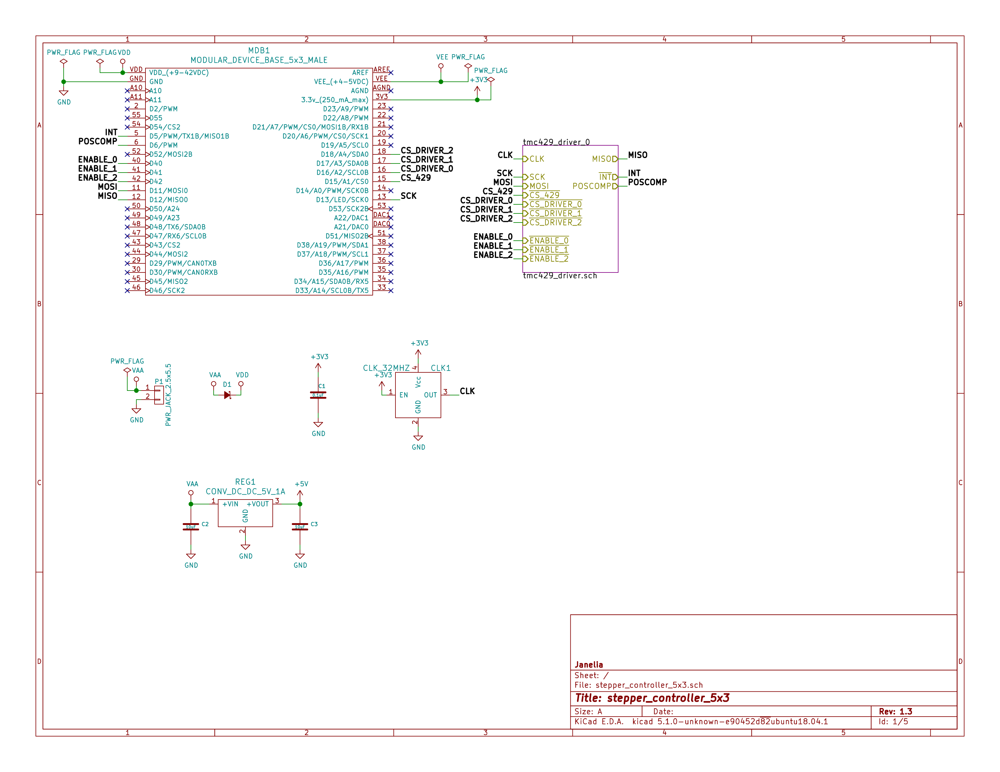

- [Repository Information](#org5ec03ca)
  - [Description](#org7f46f80)
- [Images](#orgb93c8fd)
- [Schematic](#org88a7d15)
- [Gerbers](#orgfb72b6b)
- [Bill of Materials](#org6408940)
  - [PCB Parts](#orgfd0c266)
  - [Supplemental Parts](#org921948f)
  - [Vendor Parts Lists](#orgd28785b)
- [Supplemental Documentation](#orgb8d5fc3)
  - [Assembly Instructions](#org52d2596)

# Repository Information

-   **Name:** stepper\_controller\_5x3
-   **Version:** 1.2
-   **License:** Open-Source Hardware
-   **URL:** <https://github.com/janelia-kicad/stepper_controller_5x3>
-   **Author:** Peter Polidoro
-   **Email:** peterpolidoro@gmail.com

## Description

This board controls up to 3 stepper motors with optional forward and reverse limit switches for each motor.

# Images

# Schematic

[./schematic/stepper\_controller\_5x3.pdf](./schematic/stepper_controller_5x3.pdf)

# Gerbers

Send gerbers zip file to your favorite PCB manufacturer for fabrication.

[./gerbers/stepper\_controller\_5x3\_v1.2.zip](./gerbers/stepper_controller_5x3_v1.2.zip)

# Bill of Materials

## PCB Parts

| Item | Reference(s)                              | Quantity | PartNumber        | Vendor  | Description                                                               |
|---- |----------------------------------------- |-------- |----------------- |------- |------------------------------------------------------------------------- |
| 1    | C1 C12 C13 C16 C17 C4 C5 C8 C9            | 9        | 399-13229-1-ND    | digikey | CAP CER 0.1UF 100V X7R 1210                                               |
| 2    | C10 C14 C6                                | 3        | PCE3812CT-ND      | digikey | CAP ALUM 220UF 20% 50V SMD                                                |
| 3    | C11 C15 C2 C3 C7                          | 5        | 445-4536-1-ND     | digikey | CAP CER 10UF 50V 10% X7S 1210                                             |
| 4    | CLK1                                      | 1        | CTX277LVCT-ND     | digikey | OSC XO 32.000MHZ HCMOS TTL SMD                                            |
| 5    | D1                                        | 1        | 568-11697-1-ND    | digikey | DIODE SCHOTTKY 45V 10A CFP15                                              |
| 6    | MDB1                                      | 2        | S1011E-25-ND      | digikey | 25 Positions Header Breakaway Connector 0.1in                             |
| 7    | P1                                        | 1        | CP-063BH-ND       | digikey | CONN PWR JACK DC 2.5X5.5 8A T/H                                           |
| 8    | R1 R12 R2 R7                              | 4        | P10.0KCCT-ND      | digikey | RES SMD 10K OHM 1% 1/8W 0805                                              |
| 9    | R10 R11 R13 R14 R15 R16 R3 R4 R5 R6 R8 R9 | 12       | P845CCT-ND        | digikey | RES SMD 845 OHM 1% 1/8W 0805                                              |
| 10   | REG1                                      | 1        | 945-1395-5-ND     | digikey | CONV DC/DC 1A 5V OUT SIP VERT                                             |
| 11   | SS1 SS2 SS3                               | 48       | ED90331-ND        | digikey | CONN PIN RCPT .025-.037 SOLDER                                            |
| 12   | T1 T3 T5                                  | 3        | 277-1152-ND       | digikey | TERM BLOCK HDR 4POS VERT 5.08MM                                           |
| 13   | T2 T4 T6                                  | 3        | 277-1223-ND       | digikey | TERM BLOCK HDR 4POS VERT 3.81MM                                           |
| 14   | U1                                        | 1        | 1460-1071-1-ND    | digikey | IC MOTOR CONTROLLER SPI 32QFN                                             |
| 15   | U10 U2 U4 U7                              | 4        | 296-11603-1-ND    | digikey | IC BUF NON-INVERT 5.5V SOT23-5                                            |
| 16   | U11 U5 U8                                 | 3        | 516-2614-1-ND     | digikey | OPTOISO 3.75KV 2CH PUSH PULL 8SO                                          |
| 17   | U12 U6 U9                                 | 3        | MAX6817EUT+TCT-ND | digikey | IC DEBOUNCER SWITCH DUAL SOT23-6                                          |
| 18   | U3                                        | 1        | 296-14668-1-ND    | digikey | Buffer Non-Inverting 1 Element 8 Bit per Element Push-Pull Output 20-SOIC |

## Supplemental Parts

| Item | Quantity | PartNumber       | Vendor  | Description                       |
|---- |-------- |---------------- |------- |--------------------------------- |
| 1    | 3        | 277-1013-ND      | digikey | TERM BLOCK PLUG 4POS STR 5.08MM   |
| 2    | 3        | 277-1042-ND      | digikey | TERM BLOCK PLUG 4POS 5.08MM       |
| 3    | 3        | 277-1163-ND      | digikey | TERM BLOCK PLUG 4POS STR 3.81MM   |
| 4    | 3        | 277-1193-ND      | digikey | TERM BLOCK PLUG 4POS 90DEG 3.81MM |
| 5    | 3        | 1460-1187-ND     | digikey | TMC2130 STEPPER DRIVER BOARD      |
| 6    | 3        | 501100B00000G-ND | digikey | HEATSINK 14-DIP/16-DIP            |
| 7    | 1        | 3M10315-ND       | digikey | TAPE ADHESIVE TRANSFER 1/2in X5YD |

## Vendor Parts Lists

[./bom/digikey\_parts.csv](./bom/digikey_parts.csv)

[./bom/supplemental\_digikey\_parts.csv](./bom/supplemental_digikey_parts.csv)

# Supplemental Documentation

## Assembly Instructions

-   Solder header pins into the stepper driver board(s), making note of TOP label. Insert header pins on bottom of board so that the long unsoldered header pins point down when the TOP label faces up.
-   Expose one side of the thermal adhesive tape and attach to the bottom of the heatsink. Trim tape so it does not extend beyond heatsink edges.
-   Expose the other side of the thermal adhesive tape and attach the heatsink to the stepper driver board on the side with the TOP label.
-   Solder surface mount and through hole components onto the pcb.
-   Insert stepper driver board(s) into pin receptacles.
